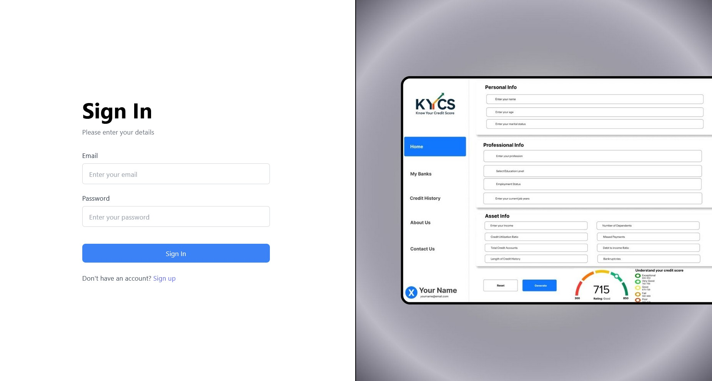

<!-- SOCIAL LINKS -->

<!-- SOCIAL LINKS -->
<div align="center">
  <a href="https://agnishwarraychaudhuri.atlassian.net/jira/software/projects/MICS/summary">
    
  </a>
</div>

<br />
<br />

<!-- PROJECT LOGO -->
<br />
<div align="center">
  <a href="https://github.com/othneildrew/Best-README-Template">
    
  </a>

  <h3 align="center">KYCS</h3>

  <p align="center">
    Know Your Credit Score
    <br />
    <a href="https://github.com/NotYC/ML-integrated-CreditScoring/tree/main"><strong>Explore the docs »</strong></a>
    <br />
    <br />
    <a href="https://github.com/NotYC/ML-integrated-CreditScoring/tree/main">View Demo</a>
    &middot;
    <a href="https://github.com/NotYC/ML-integrated-CreditScoring/issues/new">Report Bug</a>
    &middot;
    <a href="https://github.com/NotYC/ML-integrated-CreditScoring/graphs/contributors">Contributors</a>
  </p>
</div>

<br />

<!-- TABLE OF CONTENTS -->
<details>
  <summary>Table of Contents</summary>
  <ol>
    <li><a href="#ml-integrated-credit-scoring-system">About the Project</a></li>
    <li><a href="#features">Features</a></li>
    <li><a href="#tech-stack">Tech Stack</a></li>
    <li><a href="#prerequisites">Prerequisites</a></li>
    <li>
      <a href="#setup">Setup</a>
      <ul>
        <li><a href="#backend">Backend</a></li>
        <li><a href="#flask">Flask</a></li>
        <li><a href="#instructions">Instructions</a></li>
        <li><a href="#running-docker">Running Docker</a></li>
      </ul>
    </li>
  </ol>
</details>


<br />

"# Project Initiated on 8 Feb 2025" 


## ML Integrated Credit Scoring System

Traditional credit scoring methods often rely on rigid, rule-based systems that may not accurately assess the creditworthiness of diverse individuals, particularly those with limited financial history. Such systems can lead to biased decisions, inefficiencies, and missed opportunities for financial inclusion. To address these challenges, this project proposes the development of a Machine Learning Integrated Credit Scoring System that dynamically analyzes a broad range of financial and demographic factors to generate more accurate, fair, and explainable credit scores.

The proposed system is a machine learning-driven solution designed to efficiently and accurately assess an individual's creditworthiness. It replaces traditional manual evaluation methods by leveraging advanced algorithms to analyze diverse datasets, including historical credit behavior, financial profiles, and alternative data sources such as utility payments and employment trends. By automating data preprocessing, model training, and real-time scoring, the system enables lenders, banks, and fintech platforms to make faster, data-driven lending decisions while ensuring compliance and fairness.

This solution integrates Linear Regression and XGBoost machine learning models within a web application built using the MERN Stack (MongoDB, Express.js, React.js, and Node.js), combining the predictive power of machine learning with a seamless user experience. Through this approach, the system aims to enhance the precision of credit risk assessment, reduce manual errors, and support broader, more inclusive financial decision-making.

<br />

---

<h2>Preview</h2>

<br />

<p align="center">
  <h3> Sign-in<h3>
  
</p>

<br />

<p align="center">
  <h3>Link your Bank Account<h3>
  
</p>


<br />
  
<p align="center">
  <h3>Dashboard<h3>
  
</p>

<br />

<p align="center">
  <h3> My Banks<h3>
  
</p>

<br />

<p align="center">
  <h3> Credit History<h3>
  
</p>

<br />

<p align="center">
  <h3>About Us<h3>
  
</p>

<br />


<p align="center">
  <h3>Help<h3>
  
</p>

---

## Features

### 🧾 Comprehensive User Input Form
A well-structured, multi-section form that collects detailed:
- **Personal Information** – Name, DOB, Gender, Nationality, etc.
- **Professional Details** – Occupation, Annual Income, Employment type.
- **Bank & Asset Details** – Account numbers, liabilities, TIN/Passport.

### 🤖 Machine Learning-Based Credit Scoring
Integrated ML models to predict creditworthiness:
- **Linear Regression** – Interpretable model with a transparent scoring formula.
- **XGBoost** – High-performance ensemble model for superior accuracy.

### 📊 Real-Time Credit Score Visualization
- **Interactive gauge meter** to display predicted credit score.
- Categorizes scores into ranges: Poor, Fair, Good, Excellent.
- Offers intuitive insights into financial credibility.

### 🛢️ MongoDB-Powered Data Persistence
- Secure storage of user submissions and predictions.
- Enables future retrieval, analysis, and auditing.
- Structured schema design for scalability.

### 📱 Responsive Modern UI
- Built using **React.js** and styled with **Material-UI**.
- Optimized for **mobile, tablet, and desktop** screens.
- Clean UX ensures seamless multi-step form navigation.

### 🐳 Dockerized Deployment
- Entire stack containerized using **Docker** and **Docker Compose**.
- Isolated services: Backend, Frontend, ML Model API, MongoDB.
- Enables effortless setup, testing, and scaling.

### 🔧 Jenkins CI/CD Integration
- **Automated build and deployment** pipeline via **Jenkins**.
- Each code push triggers:
  - Linking and testing
  - Docker image creation
  - Containerized deployment
- Streamlines continuous integration and delivery in production-like environments.

---

## Tech Stack

- **Frontend**:

| **Technology** | **Description** |
|----------------|-----------------|
| [](https://reactjs.org) | A JavaScript library for building user interfaces. |
| [](https://mui.com) | A React component library for building modern, responsive designs. |

<br />

- **Backend**:

| **Technology** | **Description** |
|----------------|-----------------|
| [](https://nodejs.org) | JavaScript runtime for building the server. |
| [](https://expressjs.com) | A web framework for Node.js to handle backend routing. |
| [](https://flask.palletsprojects.com) | For serving machine learning models as APIs (if used in a separate service). |

<br />


- **Machine Learning**:

| **Technology** | **Description** |
|----------------|-----------------|
| [](https://xgboost.ai) | A scalable machine learning algorithm used for gradient boosting. |
| [](https://scikit-learn.org/stable/modules/linear_model.html#linear-regression) | A basic algorithm used to predict the credit score. |

<br />

- **Database**:

| **Technology** | **Description** |
|----------------|-----------------|
| [](https://www.mongodb.com) | A NoSQL database for storing user information and predicted credit scores. |

<br />

---

## Prerequisites


| **Technology** | **Description** |
|----------------|-----------------|
| [](https://nodejs.org/en) | JavaScript runtime environment for executing server-side code. |
| [](https://www.mongodb.com/products/tools/compass) | GUI for MongoDB to visualize and manage your databases. |
| [](https://www.python.org/downloads/) | High-level programming language used for backend logic and machine learning. |
| [](https://pip.pypa.io/en/stable/installation/) | Python package installer for managing dependencies. |
| [](https://www.npmjs.com/) | Node.js package manager for managing JavaScript dependencies. |


<br />

---


## Setup

### Backend (Node.js + Express)

1. Clone the repository:
   ```bash
   git clone https://github.com/yourusername/ml-integrated-credit-scoring.git
   cd ml-integrated-credit-scoring
2. Install Dependencies:
   ```bash
   cd authentication_end
   npm install


   
### ML Model (Flask)

3. Run the Flask Applicatiom
   ```bash
   cd ml-integrated-credit-scoring/PipeLine Blueprint/model side


<!-- 
### Instructions on how to run docker application of KYCS: 

1.Pull the latest commit upto "deleted files" into your system while on main branch

2.go to root directory of our capstone in terminal 

3.type docker-compose -up --build

4.open another terminal and go into bash of frontend "docker exec -it creditscore_frontend bash"

5.go to the local host port 5174 

6. Docker compose down once done!

It should be working now

Dont do any changes in main branch now

If you want to change to before docker integration , make branch from "credit history chart" of sarab commit.
-->

<br />

---

### Docker

🐳 KYCS Docker Deployment Guide
📦 Using Docker Compose (Recommended)

Docker Compose simplifies the process of managing multi-container applications.​
<ol> <li><strong>Pull the Latest Changes:</strong> <pre><code>git checkout main git pull origin main</code></pre> </li> <li><strong>Navigate to the Project Root Directory:</strong> <pre><code>cd path/to/ml-integrated-credit-scoring</code></pre> </li> <li><strong>Build and Start the Containers:</strong> <pre><code>docker-compose up --build</code></pre> </li> <li><strong>Access the Frontend Container:</strong> <pre><code>docker exec -it creditscore_frontend bash</code></pre> </li> <li><strong>Open the Application in Your Browser:</strong> <pre><code>http://localhost:5174</code></pre> </li> <li><strong>Shut Down the Application:</strong> <pre><code>docker-compose down</code></pre> </li> </ol>

⚠️ Important Notes

Branch Management: Avoid making changes directly to the main branch.​

Reverting to Pre-Docker Setup: If you need to revert to the state before Docker integration, create a new branch from the credit history chart commit by Sarab.​

Docker Installation: Ensure Docker is installed and running on your system. You can download it from <a href="https://www.docker.com/get-started" target="_blank">Docker's official website</a>.


<!-- MARKDOWN LINKS & IMAGES -->
<!-- These are just for references and havent been used yet -->


<!-- 
[contributors-shield]: https://img.shields.io/github/contributors/othneildrew/Best-README-Template.svg?style=for-the-badge
[contributors-url]: https://github.com/othneildrew/Best-README-Template/graphs/contributors
[forks-shield]: https://img.shields.io/github/forks/othneildrew/Best-README-Template.svg?style=for-the-badge
[forks-url]: https://github.com/othneildrew/Best-README-Template/network/members
[stars-shield]: https://img.shields.io/github/stars/othneildrew/Best-README-Template.svg?style=for-the-badge
[stars-url]: https://github.com/othneildrew/Best-README-Template/stargazers
[issues-shield]: https://img.shields.io/github/issues/othneildrew/Best-README-Template.svg?style=for-the-badge
[issues-url]: https://github.com/othneildrew/Best-README-Template/issues
[jira-shield]: https://img.shields.io/badge/Jira-0052CC?style=for-the-badge&logo=Jira&logoColor=white
[jira-url]: https://agnishwarraychaudhuri.atlassian.net/jira/software/projects/MICS/summary
[license-shield]: https://img.shields.io/github/license/othneildrew/Best-README-Template.svg?style=for-the-badge
[license-url]: https://github.com/othneildrew/Best-README-Template/blob/master/LICENSE.txt
[linkedin-shield]: https://img.shields.io/badge/-LinkedIn-black.svg?style=for-the-badge&logo=linkedin&colorB=555
[linkedin-url]: https://linkedin.com/in/othneildrew
[product-screenshot]: images/screenshot.png
[Next.js]: https://img.shields.io/badge/next.js-000000?style=for-the-badge&logo=nextdotjs&logoColor=white
[Next-url]: https://nextjs.org/
[React.js]: https://img.shields.io/badge/React-20232A?style=for-the-badge&logo=react&logoColor=61DAFB
[React-url]: https://reactjs.org/
[Vue.js]: https://img.shields.io/badge/Vue.js-35495E?style=for-the-badge&logo=vuedotjs&logoColor=4FC08D
[Vue-url]: https://vuejs.org/
[Angular.io]: https://img.shields.io/badge/Angular-DD0031?style=for-the-badge&logo=angular&logoColor=white
[Angular-url]: https://angular.io/
[Svelte.dev]: https://img.shields.io/badge/Svelte-4A4A55?style=for-the-badge&logo=svelte&logoColor=FF3E00
[Svelte-url]: https://svelte.dev/
[Laravel.com]: https://img.shields.io/badge/Laravel-FF2D20?style=for-the-badge&logo=laravel&logoColor=white
[Laravel-url]: https://laravel.com
[Bootstrap.com]: https://img.shields.io/badge/Bootstrap-563D7C?style=for-the-badge&logo=bootstrap&logoColor=white
[Bootstrap-url]: https://getbootstrap.com
[JQuery.com]: https://img.shields.io/badge/jQuery-0769AD?style=for-the-badge&logo=jquery&logoColor=white
[JQuery-url]: https://jquery.com  
-->

